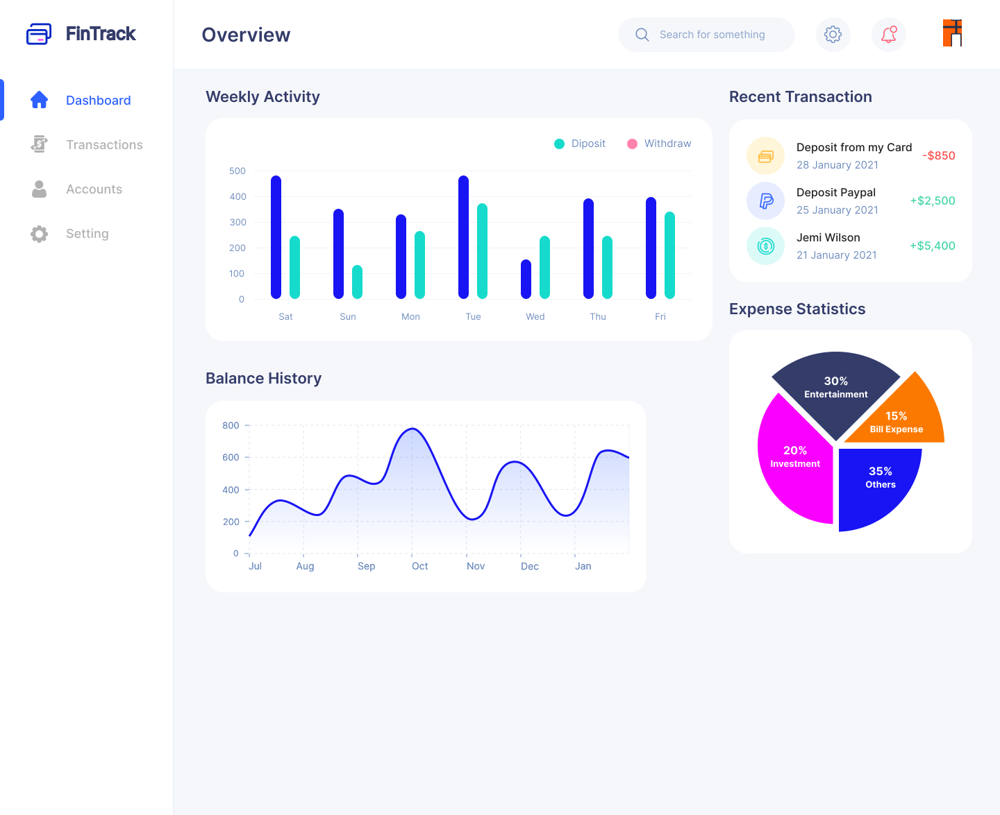

# Personal Finance Tracker Project Proposal

  

## Project Title
**FinTrack**

## Project Summary
The **FinTrack** is a web-based application designed to help users manage their financial transactions efficiently. It allows users to log income and expenses, categorize transactions, set savings goals, and visualize their financial health through interactive charts. The platform aims to provide an intuitive and automated way to track spending habits and make informed financial decisions.

## Application Description
Many individuals struggle to manage their finances effectively due to a lack of tools for tracking their daily expenses and income. This project addresses this issue by providing a user-friendly interface where users can log their transactions, set financial goals, and analyze their spending patterns.

The primary objectives of this application include:
- **Expense and income tracking:** Users can log transactions and categorize them.
- **Data visualization:** Charts and graphs to help users understand spending trends.
- **Multi-currency support:** Real-time currency exchange rate tracking.

## Creative Component
To enhance functionality and user experience, we propose the following advanced features:
1. **Interactive Financial Visualization:**
  - Advanced data visualization using libraries like D3.js or Chart.js to dynamically present spending trends and insights.
  - Users can interact with graphs, filter transactions, and visualize their expenses by category, time period, or currency.
  - The interface will include customizable dashboards where users can select which financial metrics they want to prioritize. This allows users to personalize their experiences. 
  - Users will be able to export visualizations as PDFs or images for reporting or record-keeping purposes. 
  - Comparison tools will enable users to analyze spending patterns between different time periods ("Aug vs. Sep" or "2022 vs. 2023"), allowing users to more easily track spending/budgeting procress.
  - charts will be incorporated to allow users to compare income vs. expenses side by side for a more insightful financial overview.
  - Bar charts will help visualize how different spending categories contribute to total expenses over time.
  - Real-time updates will allow users to see their financial summary dynamically change as they add or edit transactions.
2. **Multi-Currency Support:**
  - Integration with an API like [ExchangeRate-API](https://www.exchangerate-api.com/) to allow transactions in different currencies and automatic conversion.
  - Users can set a preferred base currency, ensuring all transactions are converted consistently.
  - A historical exchange rate tracking will be implemented, allowing users to view conversion rates at the time of the transaction rather than only the current rate to see overall trends.
  - An option for users to manually override exchange rates will be provided if they received a different rate (Ex. from a bank or currency exchange service).
  - Because of support for multi-currency budgets, users will be able to set spending limits in different currencies while maintaining a unified financial overview.
  - A currency switcher will be included, allowing users to view their financial data in different currencies with real-time conversion.
3. **Budget Recommendation System:**
  - Users can set financial management goals and track their progress toward completion.
  - The budget module will allow users to set recurring budgets (rent, monthly groceries, etc) for accurate budgeting functionality.
  - Users will receive real-time spending alerts when they approach or exceed a set budget limit.
  - A budget log will store past budgets, allowing users to analyze how their spending and budgeting habits have changed over time.
  - The system will provide spending breakdowns within each budget, allowing users to see which transactions are contributing most to their expenses.
    

## Usefulness
The **Personal Finance Tracker** is useful for individuals who want to maintain better control over their finances. The key functionalities include:
- **Adding, updating, and deleting transactions** categorized by type (income/expense).
- **Filtering transactions** by date, category, and amount.
- **Visualizing financial data** through pie charts, bar graphs, and line charts.
- **Setting and tracking savings goals**.

Existing finance management tools like **Mint** and **YNAB** offer similar features, but they often require subscriptions or lack the simplicity that many users desire. Our application differentiates itself by focusing on **ease of use** and **multi-currency support**. This allows our application to have an additional user base in international students, who may have expenses using different currencies, especially when returning home. 

## Realness (Data Sources)
To ensure the application handles real financial data, we will integrate at least two real-world data sources including:
1. **User-Generated Transaction Data** – Users input financial transactions manually. We will also be able to randomly assign transactions to users to simulate a variety of user transaction types. 
2. **Currency Exchange Rate API** – Integration with an exchange rate API (e.g., [ExchangeRate-API](https://www.exchangerate-api.com/)) to support multi-currency tracking.
3. **Personal Finance Dataset from Kaggle** – A dataset containing categorized personal expenses, helping to analyze spending patterns. Example: [Kaggle Personal Finance Dataset](https://www.kaggle.com/datasets/bukolafatunde/personal-finance?select=personal_transactions.csv) (Format: .csv Cardinality: 806 Degree: 6). This includes dates, names, transaction types (debit/credit), categories, and account name of each transaction. 
4. **Bank Transactions Dataset from Kaggle** – A dataset simulating real-world banking transactions, useful for training and testing features like automated transaction categorization. Example: [Kaggle Bank Transactions Dataset](https://www.kaggle.com/datasets/priyamchoksi/credit-card-transactions-dataset) (Format: .csv Cardinality: 1.30m Degree: 24). This dataset includes the date, category, amounts, and names of the users who made transactions.
   

## Functionality
The application provides the following key functionalities:
### **Basic Features**
- **Create, Read, Update, Delete (CRUD) transactions** (income/expenses).
  - Create: Users can make new financial transactions by entering relevant information including payment amount, category   
  selection, date, along with payment method and currency choice. The system will preserve transactions within the database 
  which automatically displays them in the dashboard. These transactions will be automatically converted into a specific currency based on real-time exchange rates. 
  - Read: Users benefit from a complete overview of their previous financial movements which they can refine by date intervals, financial   
  categories, transaction amounts or organize them via their preferred order to examine their spending patterns. Users will find an overall 
  display which shows total income and expenses and current account balance in the system. Additionally, FinTrack will make suggestions for categories to reduce spending in. 
  - Update: Users have an option to change details for active transactions including category selection and changing amounts and dates. All 
  modifications made to financial data in the system automatically display within both summary views and visual displays.
  - Delete: Users can remove unnecessary or incorrect transactions from their records. Deleting a transaction will update the total balance 
  and spending insights to maintain accuracy in financial tracking.
- **Categorize transactions** (e.g., groceries, rent, entertainment). This allows for clear understanding of where money is going
- **Search and filter transactions** based on category, amount, and date. 
- **Set and track financial goals**

### **Advanced Features**
- **Data visualization dashboard** with interactive charts where users are able to sort and select based on category, date, and more. 
- **Multi-currency transactions with real-time conversion.** This allows users to input spending in various currencies, as well as keep track of exchange rates. 

## Low-Fidelity UI Mockup

## Project Work Distribution
| Team Member | Responsibility |
|-------------|---------------|
| Hanna | Backend development: Database design, CRUD APIs |
| Yuhao | Frontend development: UI design, charts, form handling |
| Hanzhang | data processing, currency API integration |
| Tong | Deployment, documentation, and presentation preparation |

## Backend System Distribution
- **Database:** PostgreSQL/MySQL for storing transactions, user data, and budgets.
- **API Integration:** Currency exchange.
- **Authentication:** Secure user login using OAuth or JWT.
- **Deployment:** Hosted on AWS/Heroku with CI/CD pipelines.

